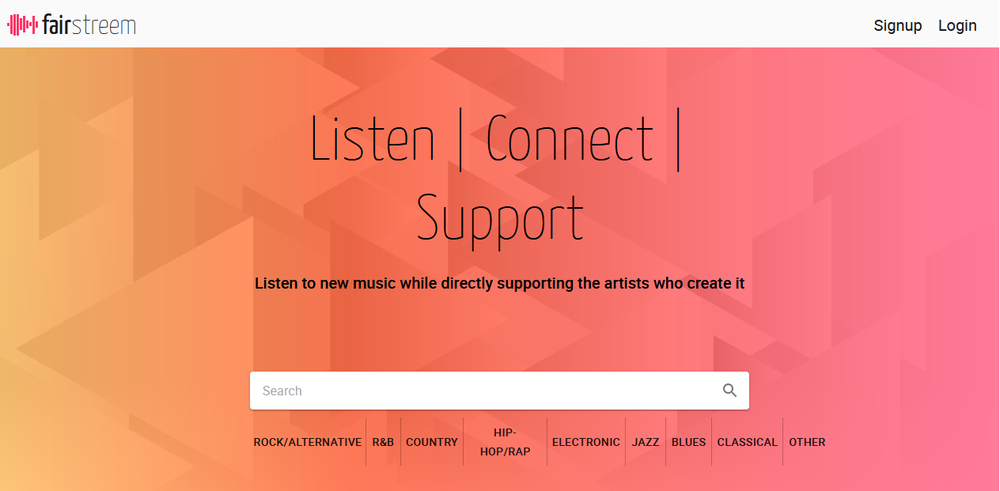
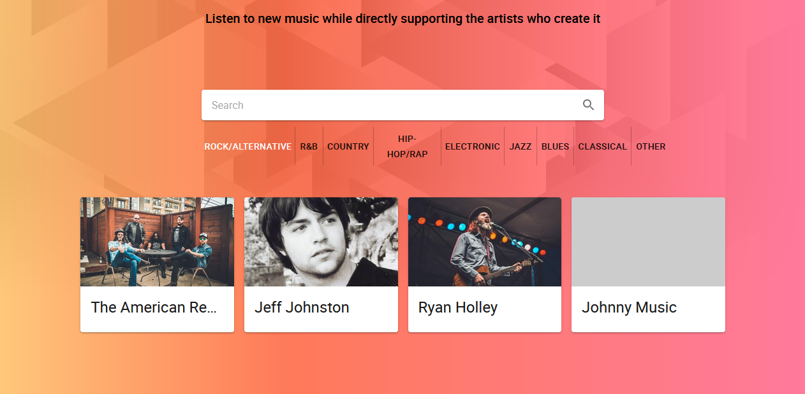
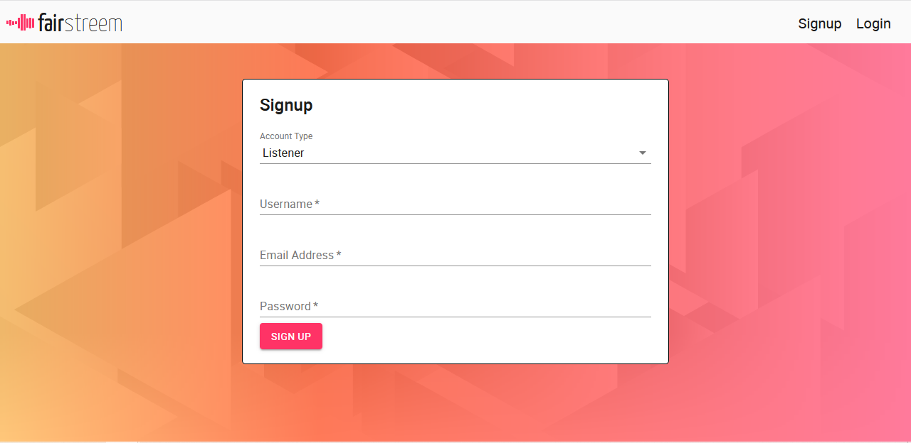
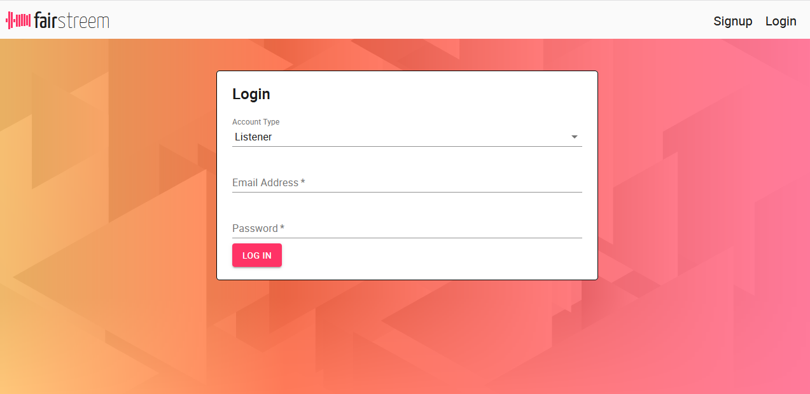
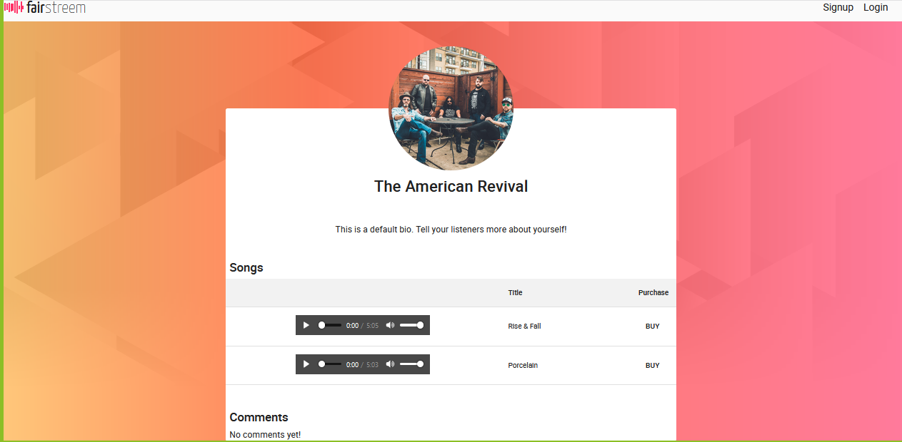

# `FairStreem`™
This application carries a conditonal and unconventional license. See below for [details](#license).

## Description
FairStreem is a new music streaming and social media application that provides: 
* A mission to refine the streaming business model in favor of artists.
* A template for other developers committed to the mission to build their own streaming apps.
* Communication and feeback lines between listeners and artists.
* Increased control by artists regarding how their work is monetized.
* A direct line of support to artists from listeners.

## Table of Contents
* [Usage](#usage)
* [License](#license)
* [Contributing](#contributing)
* [Questions](#questions)

## Link to Deployed Application
<a href="https://fairstreem.herokuapp.com/">FairStreem</a>

## Screenshots

## `Usage`
**IMPORTANT:** FairStreem is currently in the very early stages of development. Payments and purchases are mock-included for proof-of-concept demonstration only, and are not enabled at this time. Please do not put any actual private payment information into the Stripe inputs while using this application. Please follow the instructions given by [Stripe](https://stripe.com/docs/testing) when testing the cart checkout features. 

To share music, sign-up as an Artist on the homepage. Then upload and set prices for indidivual songs on your Artist page. Users will then be able to visit your page and listen to your music and/or mock-purchase and download it. To listen to music, sign-up as a Listener. Use the homepage search bar to find your favorite artist or music genre. Go to the Artist's page to stream or mock-purchase and download music. You can also "like" your favorite Artists.

## `User Story`
User Story
AS A Musician/Artist\
I WANT to be able to share music with listeners\
WHILE MAINTAINING CONTROL of how my content is monetized\
AS A Listener\
I WANT to be able to listen to music\
AND support my favorite artists

## `License`

Permission is hereby granted, free of charge, to any person obtaining a copy of this software and associated documentation files (the "Software"), to deal in the Software without restriction, including without limitation the rights to use, copy, modify, merge, publish, distribute, sublicense, and/or sell copies of the Software, and to permit persons to whom the Software is furnished to do so, subject to the following conditions:

The above copyright notice and this permission notice shall be included in all copies or substantial portions of the Software.

THE SOFTWARE IS PROVIDED "AS IS", WITHOUT WARRANTY OF ANY KIND, EXPRESS OR IMPLIED, INCLUDING BUT NOT LIMITED TO THE WARRANTIES OF MERCHANTABILITY, FITNESS FOR A PARTICULAR PURPOSE AND NONINFRINGEMENT. IN NO EVENT SHALL THE AUTHORS OR COPYRIGHT HOLDERS BE LIABLE FOR ANY CLAIM, DAMAGES OR OTHER LIABILITY, WHETHER IN AN ACTION OF CONTRACT, TORT OR OTHERWISE, ARISING FROM, OUT OF OR IN CONNECTION WITH THE SOFTWARE OR THE USE OR OTHER DEALINGS IN THE SOFTWARE.

`Conditions:`
The FairStreem brand name and logo are trademarked and protected by copyright, and may not be duplicated. However, the code FairStreem was originally built upon and that remains shared in this specific repository is open source. We encourage others to contribute in the effort to make the streaming industry more equitable and lucrative for the artists who enable it to profit and thrive. If more apps arise as a result of this project with that primary goal in mind, we believe the competition will only serve to help fulfill our intentions. All we ask is that you choose your own name, logo, and front-end design. 

## Contributing

Developers who worked on this project are: 

### `Alyssa Klopfenstein`
* Development focus: Front end
* Primary designer of brand logo and overall site apperance.
* Implemented search bar functionality, image uploading and conditional rendering.

### `Claire Puckett`
* Development focus: Front end
* Primary designer of aritst view page, artist profile, and comments.
* Established front end song file upload capability.

### `Ida Krause`
* Development focus: Front end
* Primary designer of login and signup forms.

### `Tony Zeuch`
* Development focus: Back end
* Established and maintained dual (artist/listener) back end signup and login functionality.

### `Jeffery Johnston`
* Development focus: Back end 
* Creator of concept, brand name, and owner of trademark and copyright. 
* Established utilization of global state for artist data distribution. 
* Primary designer of backend organization (models, schemas, etc..).
* Administrator of AWS S3 bucket storage, authorization assignments and asset management.
* Established dual (artist/listener) authorization token functionality.
* Assisted with front and back end debugging.

## Questions

Send any questions to the following email address:
jeffwjohn@yahoo.com